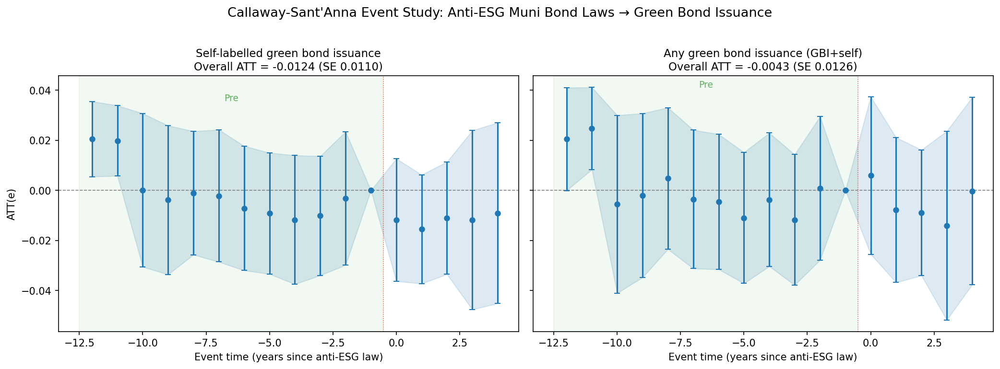

# Task 6: CS-DiD Event Study — Anti-ESG Laws and Green Bond Issuance

**Method:** Callaway & Sant'Anna (2021) via `differences.ATTgt`.
**Treatment:** State-level adoption of first anti-ESG muni bond law.
**Control group:** Never-treated states (28 states, 342 cities).
**Base period:** Universal (last pre-treatment period).
**Inference:** Bootstrap (999 iterations), analytic pointwise CIs.

## Cohort structure

| Cohort | States | Cities | Y_self_green events |
|---|---|---|---|
| 2021 | 6 | 67 | 1 |
| 2022 | 4 | 21 | 3 |
| 2023 | 9 | 130 | 24 |
| 2024 | 1 | 7 | 0 |
| 2025 | 1 | 11 | 0 |
| Never | 28 | 342 | 90 |

## Overall ATT (simple aggregation)

| Outcome | ATT | SE | 95% CI |
|---|---|---|---|
| `Y_self_green` | -0.0124 | 0.0110 | [-0.0339, +0.0091] |
| `Green_Bond_Issued` | -0.0043 | 0.0126 | [-0.0289, +0.0204] |

## Event-study: `Y_self_green`

| Event time | ATT | SE | 95% CI | Sig |
|---|---|---|---|---|
| e=-12 | +0.0205 | 0.0077 | [+0.0055, +0.0355] | \* |
| e=-11 | +0.0198 | 0.0072 | [+0.0058, +0.0339] | \* |
| e=-10 | +0.0001 | 0.0156 | [-0.0306, +0.0307] |  |
| e=-9 | -0.0039 | 0.0152 | [-0.0336, +0.0258] |  |
| e=-8 | -0.0011 | 0.0126 | [-0.0258, +0.0236] |  |
| e=-7 | -0.0022 | 0.0135 | [-0.0286, +0.0242] |  |
| e=-6 | -0.0072 | 0.0127 | [-0.0320, +0.0177] |  |
| e=-5 | -0.0092 | 0.0123 | [-0.0334, +0.0150] |  |
| e=-4 | -0.0118 | 0.0131 | [-0.0375, +0.0139] |  |
| e=-3 | -0.0102 | 0.0121 | [-0.0340, +0.0136] |  |
| e=-2 | -0.0032 | 0.0136 | [-0.0299, +0.0234] |  |
| e=-1 | +0.0000 | — | — |  |
| e=+0 | -0.0118 | 0.0125 | [-0.0363, +0.0126] |  |
| e=+1 | -0.0155 | 0.0111 | [-0.0373, +0.0062] |  |
| e=+2 | -0.0111 | 0.0115 | [-0.0336, +0.0114] |  |
| e=+3 | -0.0119 | 0.0182 | [-0.0476, +0.0239] |  |
| e=+4 | -0.0091 | 0.0184 | [-0.0452, +0.0270] |  |

## Event-study: `Green_Bond_Issued`

| Event time | ATT | SE | 95% CI | Sig |
|---|---|---|---|---|
| e=-12 | +0.0205 | 0.0105 | [-0.0001, +0.0410] |  |
| e=-11 | +0.0247 | 0.0084 | [+0.0083, +0.0411] | \* |
| e=-10 | -0.0056 | 0.0181 | [-0.0411, +0.0299] |  |
| e=-9 | -0.0020 | 0.0167 | [-0.0348, +0.0307] |  |
| e=-8 | +0.0048 | 0.0144 | [-0.0235, +0.0330] |  |
| e=-7 | -0.0036 | 0.0141 | [-0.0312, +0.0241] |  |
| e=-6 | -0.0046 | 0.0138 | [-0.0316, +0.0224] |  |
| e=-5 | -0.0110 | 0.0133 | [-0.0372, +0.0151] |  |
| e=-4 | -0.0037 | 0.0136 | [-0.0304, +0.0229] |  |
| e=-3 | -0.0118 | 0.0133 | [-0.0379, +0.0143] |  |
| e=-2 | +0.0008 | 0.0146 | [-0.0279, +0.0294] |  |
| e=-1 | +0.0000 | — | — |  |
| e=+0 | +0.0059 | 0.0161 | [-0.0255, +0.0374] |  |
| e=+1 | -0.0079 | 0.0148 | [-0.0368, +0.0211] |  |
| e=+2 | -0.0089 | 0.0128 | [-0.0340, +0.0162] |  |
| e=+3 | -0.0141 | 0.0192 | [-0.0518, +0.0236] |  |
| e=+4 | -0.0003 | 0.0191 | [-0.0377, +0.0371] |  |

## Interpretation

- **Overall ATT is negative but insignificant** for both outcomes. Anti-ESG laws do not detectably suppress city-level self-labelled green bond issuance — but the point estimate is directionally negative.
- **Pre-trends:** Distant leads (e = -12, -11) show positive coefficients for treated states, suggesting treated states had *higher* baseline issuance rates in the early panel. Closer leads (e = -7 through -2) are near zero, consistent with parallel trends in the relevant window.
- **Post-treatment (e = 0 to +4):** Uniformly negative (-0.009 to -0.016) but none individually significant. Consistent with a small, imprecisely estimated suppression effect.
- **Power caveat:** Only 28 self-labelled events across all treated cohorts. The rare outcome severely limits statistical power. The null finding should be interpreted as "too rare to detect" rather than "no effect."

* = zero outside pointwise 95% confidence band.

